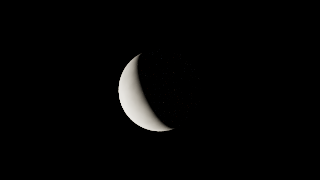
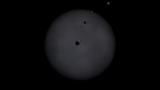
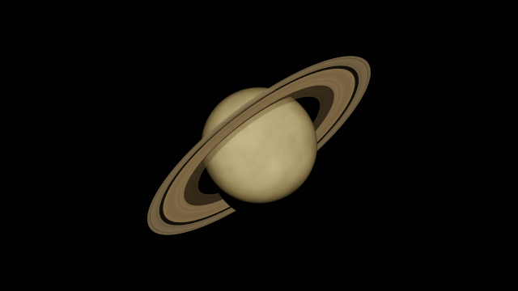

# stargaze

An observatory on a planet, looking out at a star system. Stand still and watch
Keplerian orbits through an alt-azimuth telescope—or pause time and let the
**progressive, fully ray-traced image** converge.

The default observatory is back on **Halo**, the tidally locked inner moon
of **Calyx** in the fictional binary-star system. The telescope faces Calyx
and its rings, which end about **10,256 km before Halo's nearest surface**.
Halo now orbits 29,920 km from Calyx's centre (25% farther out).
Halo's circular orbit and matching rotation keep Calyx fixed in the sky,
without camera tracking. The observatory is two metres above the surface at
35° N on the planet-facing hemisphere, with an initial 80° field of view.
Press `1` to aim at Calyx. Run `cargo run --release` to start here.

`STARGAZE_SYSTEM=halo` or `binary` explicitly selects this view.
`STARGAZE_SYSTEM=solar` selects Saturn at 20° N;
`STARGAZE_SYSTEM=earth` selects the Earth observatory, aimed at the Moon;
`STARGAZE_SYSTEM=calyx` selects the planet-side observatory, aimed at Halo.

## Rendering

All scene visibility and illumination are traced in a WGSL compute shader:

- **Primary rays**, jittered within each pixel, intersect analytic spheres.
  There are no rasterized body meshes, minimum-size planet impostors, shadow
  maps, or screen-space eclipse masks.
- **Finite stars:** emissive spheres appear as discs. At each diffuse surface
  hit, the integrator samples a direction uniformly over each star's apparent
  solid-angle disc, then traces a visibility ray. Blocked samples contribute
  nothing. **Umbras, penumbras and annular eclipses emerge from these samples**,
  not from a smoothed shadow-cylinder approximation. The system's own stars are
  real geometry: zooming in resolves their true physical discs, which also
  govern occlusion, shadowing and light sampling. The two binary suns use
  inflated radii with unchanged `luminosity`, keeping total light output the
  same while thickening their discs.
- **Indirect illumination:** cosine-weighted Lambertian bounces, power-heuristic
  multiple importance sampling (MIS), and Russian roulette. MIS combines disc
  samples and bounce rays that hit stars without double-counting sunlight.
- **Consistent emission:** the same stellar radiance is used for visible stars
  and surface illumination. Uniform-radiance stellar discs are assumed; no
  limb darkening is currently modeled. Inverse-square dilution follows from
  the star's decreasing solid angle, not an additional falloff multiplier.
- **Real ground:** the observer's planet is included in intersections. The
  camera stands at the configured height above its surface (two metres by default); the horizon is not a sky mask.
- **Rings:** an analytic, zero-thickness equatorial annulus around a body.
  Rays intersect the ring plane and are kept between the inner and outer
  radius. The sheet is a plane-parallel particulate slab: ray and shadow rays
  are attenuated by Beer-Lambert extinction at the local optical depth, an
  unscattered straight-through path is a null event so paths keep crossing the
  plane, and scattered light uses an isotropic single-scattering BSDF. Both
  reflected and transmitted light use the finite-slab single-scattering
  integral, so backlit rings emerge without adding energy. Multiple scattering
  within the particulate slab is not yet modeled. A radial profile supplies
  Saturn-like C/B/A bands, the Cassini division and the Encke and Keeler gaps.
  Rings cast
  shadows on their planet and are shadowed by it, and shadow rays pass through
  every intervening ring without ever passing through an opaque sphere.
- **Background stars:** fixed angular emissive discs at infinity, intersected
  by miss-ray directions. A conservative spherical grid accelerates catalogue
  lookup. There is no artificial Sun-altitude fade or minimum pixel size.
  Camera-visible stars are capped to a three-pixel-radius dot in the tangent
  projection. The procedural catalogue is a visual backdrop and does not
  illuminate surfaces, avoiding bright random speckles on dark ground. Finite
  scene stars, planets, moons and rings retain their light transport.
- **Host atmosphere:** an exponential Rayleigh + Mie shell attenuates camera
  rays and adds single-scattered light from finite stellar discs. Visibility
  rays account for the host horizon and eclipsing bodies. Earth and Calyx
  use an Earth-like 8.5 km scale height and 80 km atmosphere top; the Saturn
  observatory and airless Halo omit atmospheric scattering. Integration
  uses 24 view steps and 12 light-path steps; it is an approximation, not a
  multiple-scattering volumetric path tracer. Surface lighting and secondary
  bounces still use vacuum transport. There is no refraction, artificial
  ambient light, or red lunar-eclipse glow. `Scene::atmosphere = None` disables
  the shell. Surfaces retain energy-conserving procedural diffuse albedos.

Exposure is applied when presenting the accumulation, never inside it, so
changing it does not discard the converged image. Automatic metering builds a
luminance histogram of the central region of the frame and maps a high
percentile to a reference luminance, easing toward the result to avoid
flicker; exposure compensation shifts either mode in stops. Metering the whole
frame would fail here: background stars are far brighter per pixel than a
distant planet, so a global percentile would expose for the starfield and
leave the observed body black.

Each frame adds fresh Monte Carlo samples to a linear HDR running average.
The window title shows **samples per pixel (spp)**. Pause time and stop moving
for convergence; motion/time changes reset the average. HUD and label toggles
preserve it. Resize, material, camera, or integrator changes invalidate it.
At low sample counts, noise is expected, particularly in indirect lighting.
The average stops at 16,777,216 spp to avoid counter/float precision loss.

Only tone-mapped presentation and the HUD use ordinary rasterization. No
hardware ray-tracing extension or RT-capable GPU is needed: a native wgpu
compute-capable Metal, Vulkan or DX12 device is sufficient.

### Sample renders

Reference path-traced output at 64 samples per pixel, without the HUD
(captured before the host-atmosphere addition):

| Luna | Eclipse on distant Vantus | Saturn and its rings |
| --- | --- | --- |
|  |  |  |

The first two are generated by the `gpu_scene_smoke` test and Saturn by
`gpu_saturn_scene`; both write PPM frames when `STARGAZE_TEST_IMAGE_DIR` is
set. The original project
vision is preserved in [`idea.md`](idea.md).

## Build & run

Requires a recent stable Rust toolchain compatible with wgpu 30
(tested with Rust 1.98.1).

```sh
cargo run --release
STARGAZE_SYSTEM=solar cargo run --release
```

If installing Rust using rustup for the first time, load its environment with
`source "$HOME/.cargo/env"` before running Cargo.

### Define a system with YAML

```sh
cargo run --release -- --config configs/halo.yaml
cargo run --release -- --config configs/solar-system.yaml
cargo run --release -- --check-config configs/halo.yaml
```

The default launch reads `configs/halo.yaml` from the project directory at
runtime. The second config contains the Sun, all eight planets and selected
moons, with the camera on Earth looking at the Moon. Edit either file or
create your own; changes take effect on the next launch without rebuilding.
`STARGAZE_CONFIG=/path/to/system.yaml` also selects a file; an explicit
`--config` takes precedence. `--check-config` validates without a display or GPU.

The format names bodies by ID and defines their physical radii, orbits,
rotation, rings, and the camera's host, latitude, longitude, height, target,
and FOV. `rotation: {mode: tidal_lock}` synchronizes a body's spin with its
orbit. Optional `time_days` fixes the starting time; otherwise Stargaze
searches for a suitable night view. Unknown fields and invalid references or
geometry produce contextual errors.

See the [complete format and example](skills/define-solar-system/references/config-format.md).
The repository also includes the [define-solar-system skill](skills/define-solar-system/SKILL.md),
installed locally for prompts such as:

> Use $define-solar-system to create a ringed gas giant viewed from an airless,
> tidally locked moon. Place the camera at 25° north on the planet-facing side.

### Realistic solar-system preset

```sh
./scripts/solar-system.sh
# Equivalent:
STARGAZE_SYSTEM=solar cargo run --release
```

Starts on **Saturn at 20° N, longitude 0°**, looking toward the inner B ring.
The camera follows Saturn's rotation and stays two metres above the modeled
spherical surface. Saturn's gaseous atmosphere and cloud layers are not yet
modeled; this view uses the existing spherical surface without the Earth-like
atmospheric shell.

The initial aiming target is **S/2009 S 1**, the small moonlet inside the B
ring, approximately 117,000 km from Saturn's centre. Its 150 m radius,
circular equatorial orbit and synchronous rotation are simplified assumptions;
see [NASA's discovery image](https://science.nasa.gov/photojournal/a-small-find-near-equinox/).

The Sun and all eight planets use physical mean radii and approximate orbital
elements. The scene also includes the Moon, Phobos, Deimos, Io, Europa,
Ganymede, Callisto, Titan, Titania and Triton. Satellite orbits follow their
parent's tilted equator where appropriate. The Earth observatory remains
available with `STARGAZE_SYSTEM=earth`, with its atmosphere enabled.

The shortcuts below describe the Saturn observatory. In the Earth preset,
key `7` aims at Saturn (body index `8`).

| Key | Target | `STARGAZE_AIM` body index |
| --- | --- | --- |
| `1` | Moon | `2` |
| `2` | Sun | `0` |
| `3` | Mercury | `5` |
| `4` | Venus | `6` |
| `5` | Mars | `3` |
| `6` | Jupiter | `7` |
| `7` | S/2009 S 1 (inner rings) | `19` |
| `8` | Uranus | `9` |
| `9` | Neptune | `10` |

For example, `STARGAZE_SYSTEM=solar STARGAZE_AIM=7 cargo run --release`
starts aimed at Jupiter and the Galilean moons.

**Accuracy limits:** planet elements start from approximate J2000 values and
remain fixed Kepler ellipses. Moon phases and pole longitudes are simplified;
time is model days, not a reliable calendar-date ephemeris. There are no mutual
gravitational perturbations, precession, light-time corrections or atmospheric
refraction. Bodies remain spherical with approximate diffuse colours and
procedural surfaces: ring thickness and self-gravity wakes, planet oblateness,
and photographic/cloud-band textures are not yet modeled. Rings are an
infinitesimally thin sheet, so an exactly edge-on view loses them. `Rings`
is attached to Saturn and to Calyx in the Halo preset; any body may carry one. The background star catalogue is procedural.

### Quality settings

```sh
# Eight new samples per pixel per frame; up to 12 surface vertices per path.
STARGAZE_SPP=8 STARGAZE_BOUNCES=12 cargo run --release

# Force a fixed exposure to inspect the bright solar disc.
STARGAZE_SYSTEM=solar STARGAZE_AIM=0 STARGAZE_AUTO_EXPOSURE=0 STARGAZE_EXPOSURE=0.00001 cargo run --release
```

| Variable | Default | Meaning |
| --- | --- | --- |
| `STARGAZE_SPP` | `1` | Samples per pixel per frame, clamped to 1–64 |
| `STARGAZE_BOUNCES` | `8` | Maximum surface vertices per path, clamped to 1–64; `1` gives direct-only lighting |
| `STARGAZE_AUTO_EXPOSURE` | on | Meter exposure automatically; `0`, `false` or `off` selects the manual value |
| `STARGAZE_EXPOSURE` | `1` | Manual exposure multiplier, applied after accumulation when automatic metering is off |
| `STARGAZE_EV_BIAS` | `0` | Exposure compensation in stops, applied to either mode |
| `STARGAZE_AUTO_KEY` | `0.25` | Linear luminance the metered percentile is mapped to |
| `STARGAZE_AUTO_PERCENTILE` | `0.9` | Which luminance percentile of the centre region to meter, clamped to 0.01–0.999 |

Increasing samples per frame makes each frame slower, not intrinsically more
accurate than accumulating the same total sample count over more frames. The
bounce limit truncates long light paths; increase it for higher-albedo scenes.
Russian roulette starts after three diffuse vertices. The pseudo-random
sequence is deterministic for a given pixel and sample index.

### Controls

| Input | Action |
| --- | --- |
| left-drag (sky) | look around |
| left-click (body) | lock the telescope onto that body; click empty sky or start a drag to release |
| scroll / `=` / `-` | zoom, down to 0.001° |
| `-1d` `-1h` `-1m` `+1m` `+1h` `+1d` (bar) | step simulation time |
| Labels toggle (bar) | show / hide names |
| Exposure slider (right of time buttons) | brightness compensation, −8 to +8 EV in quarter stops, in either mode |
| Auto checkbox (bar) | enable / disable automatic exposure metering |
| space | play / pause; pause to accumulate a clean image |
| `[` `]` | slower / faster time |
| `1`–`9` | aim at scene targets (`9` is solar-only) |
| `E` | search up to ten model years for a visible eclipse |
| `T` | search for a moon transit (e.g. Phobos/Mars or Io/Jupiter) |
| `R` | reset view |
| `,` `.` | exposure compensation down / up by 0.25 EV |
| `A` | toggle automatic exposure metering (on by default) |
| `H` | show / hide HUD |
| `L` | toggle labels |
| esc | quit |

Clicking a body locks the view to it: as simulation time advances the
telescope keeps pointing at that body, so it stays framed while its phase and
position change. The locked body's label is bracketed in the sky. Clicking
empty sky, dragging, aiming with a number key, or resetting releases the lock.

Startup helpers (body indices depend on the selected system):

```sh
STARGAZE_SYSTEM=solar STARGAZE_FIND_ECLIPSE=1 cargo run --release
STARGAZE_SYSTEM=solar STARGAZE_FIND_TRANSIT=1 cargo run --release
STARGAZE_SYSTEM=solar STARGAZE_TIME=245.92 STARGAZE_AIM=2 STARGAZE_NO_ADVANCE=1 cargo run --release
STARGAZE_DEBUG=1 cargo run
```

`STARGAZE_FOV` overrides the vertical field of view in degrees.
`STARGAZE_FIND_PHOBOS` remains a legacy alias for `STARGAZE_FIND_TRANSIT`.

### Distant-planet eclipse preset

```sh
./scripts/vantus-eclipse.sh
```

Starts paused at **day 444.478**, aimed tightly at **Vantus** from Calyx, about
**2.72 AU (407 million km)** away. Its moon **Iri** casts a visible shadow by
blocking **Aur**; the second star still illuminates the shadowed surface.
Leave the view stationary to converge, or step time with the HUD's minute
buttons. The launcher fixes the time, target and field of view without changing
the ordinary startup defaults.

## Implementation

- Rust + wgpu + winit, with an analytic, stateless orbit simulation.
- Orbital positions, camera subtraction and rotation into telescope space use
  CPU `f64`. Primary rays stay in telescope space so extreme-zoom pixel jitter
  is not rounded away in world-space unit vectors. Sphere centres are uploaded
  as high/low `f32` parts. Secondary ray origins are body-local, and
  intersections use closest-approach cross products rather than subtracting
  nearly equal squared astronomical distances. Stable quadratic roots also
  prevent false ground hits when the camera is close to a planet's surface.
  Ray offsets scale with radius.
  GPU direction/intersection arithmetic is still `f32`, so extreme zooms and
  near-tangent hits have finite precision; more samples do not fix that error.
- Up to 256 scene bodies; all spheres and rings are tested directly,
  including every luminous star and every potential blocker. No BVH is needed
  for the current scenes.
- One compute invocation per pixel; accumulation uses 16 bytes per pixel.
- ACES tone mapping followed by sRGB presentation. No denoiser or adaptive
  sampling is currently applied.

| File | Purpose |
| --- | --- |
| `src/sim.rs` | Kepler solver, rotation and binary scene |
| `src/solar.rs` | solar YAML preset and legacy Saturn observatory |
| `src/config.rs` | versioned YAML loading, validation, and body reference resolution |
| `configs/*.yaml` | editable star systems and surface cameras |
| `src/camera.rs` | observer anchored to the rotating host planet |
| `src/main.rs` | events, time, frame assembly, labels |
| `src/pathtracer.rs` | compute pipeline, accumulation and invalidation |
| `src/shaders/pathtrace.wgsl` | sphere intersections and light transport |
| `src/shaders/rings.wgsl` | ring intersection, optics and scattering |
| `src/shaders/display.wgsl` | HDR tone mapping |
| `src/renderer.rs` | window presentation and HUD |
| `src/stars.rs` | procedural catalogue and spherical lookup grid |
| `src/ui.rs` | HUD geometry and font atlas |

## Tests

```sh
cargo fmt --check
cargo clippy --all-targets -- -D warnings
cargo test
# Opt-in, actual shader execution on a GPU; no window required:
cargo test gpu_ -- --ignored --nocapture
# Also save small reference renders as PPM images:
STARGAZE_TEST_IMAGE_DIR=/tmp/stargaze-renders cargo test gpu_scene_smoke -- --ignored --nocapture
```

Tests cover WGSL validation and buffer layouts, accumulation invalidation,
star-grid seam/pole coverage, actual GPU emission, finite-disc irradiance,
umbras, penumbras, annular eclipses, multiple stars, MIS, indirect reflected
light, distant-surface self-intersection, deep-zoom label alignment, picking,
tracking and click/drag handling, atmosphere units, extinction, twilight and
atmospheric eclipses, screen-space star caps and dark ground without catalogue
fireflies, near-surface horizon intersections, ring geometry and Beer-Lambert
transmission, ring scattering, energy conservation and shadows, MIS through
transparent rings, exposure at small viewport sizes and after convergence,
extreme exposure presentation, solar-system scales and rotation,
all seven planets observable from Earth, resize, presentation, and all
observatory presets (including Halo facing ringed Calyx, Saturn at 20° N,
and the Vantus eclipse).
