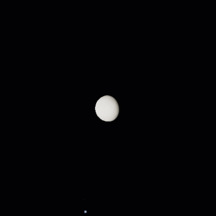
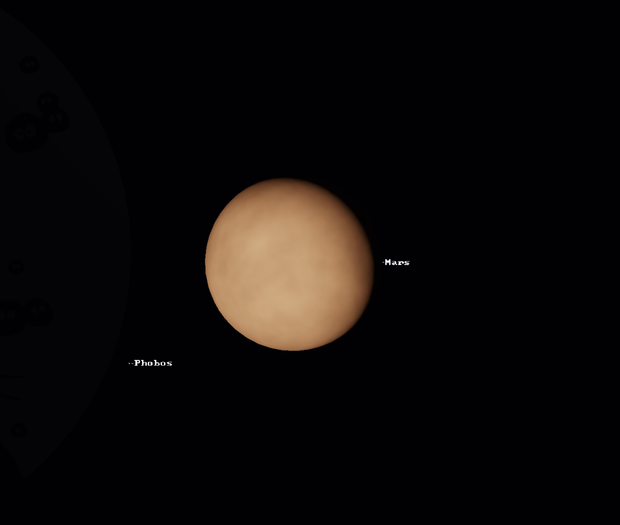
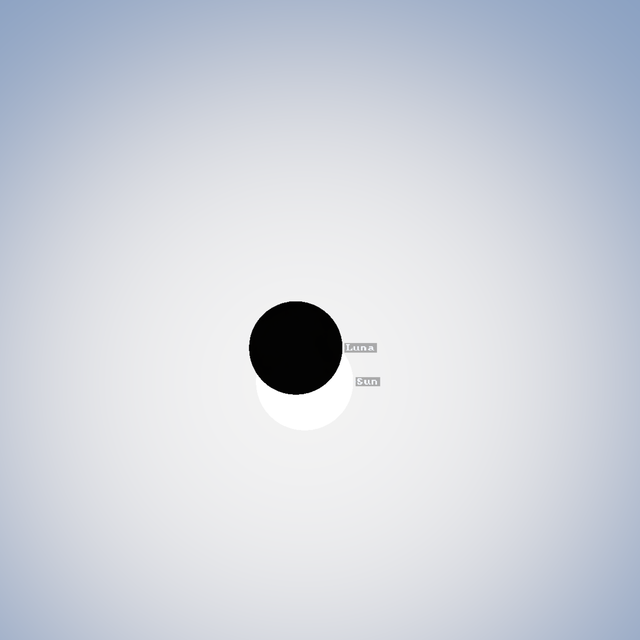
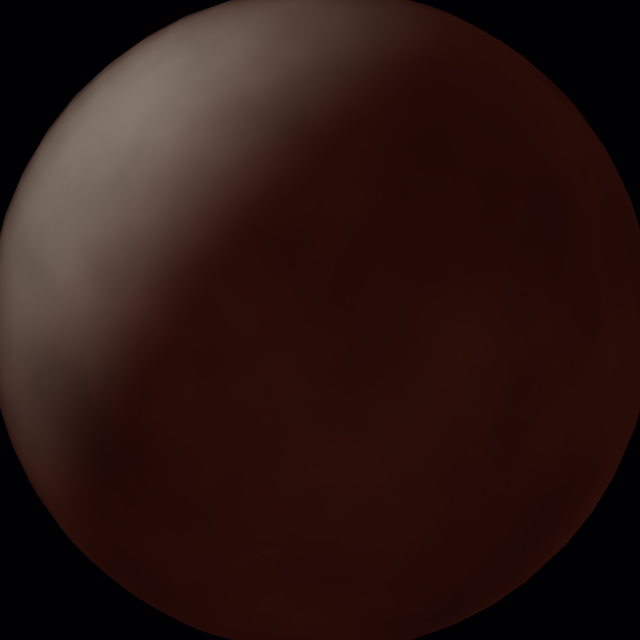
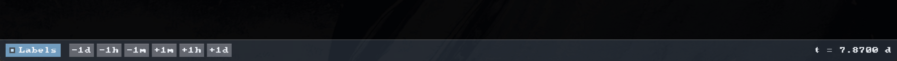
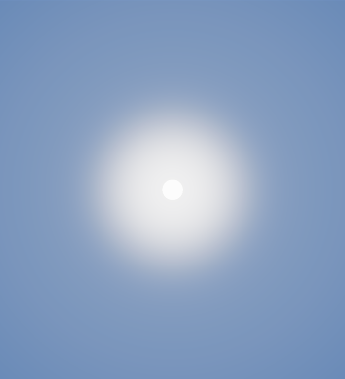

# stargaze

An observatory on a planet, looking out at a solar system. The point is not to
fly through space but to *stand still and watch the sky move* — the feeling of
sitting at a telescope while the night turns.

This is the MVP of the rendering engine described in [`idea.md`](idea.md).













## What it does

- A star system with one **Sun**, two **planets** (Terra, Mars) and one **moon**
  each (Luna, Phobos), all moving on analytic Keplerian orbits.
- The telescope stands on **Terra**, at 35° latitude, and looks around with an
  alt-azimuth mount.
- **Stars**: a procedurally generated catalogue (blackbody-coloured, with a
  faint Milky Way band) that fades out as the Sun rises.
- **Day and night**: the sky, ground and stars respond to the Sun's altitude.
- **A HUD bar** with delicate time-step buttons (`-1d -1h -1m +1m +1h +1d`), a
  **labels** toggle, and the current date. Body names (Sun, Luna, Mars, Phobos)
  can be drawn next to the objects on screen.
- **Sun**: a limb-darkened, emissive disc with atmospheric glow.
- **Eclipses**: the Moon can pass in front of the Sun (solar) and fall into
  Terra's shadow (lunar, with a faint red umbra). Cast shadows are general, so
  a moon can also shadow its planet — Phobos transits Mars and drops a small
  dark shadow on its face. Press `E` for the next Moon/Sun eclipse, `T` for the
  next Phobos transit of Mars.
- **Planets and moons**: lit spheres with inverse-square falloff, procedural
  surface mottling, and a cylinder shadow test so the Moon can fall into
  Terra's shadow (lunar eclipses).
- **Time is scrubbable**: pause, run from 0.001 to 40 simulated days per real
  second, or step precisely by a minute, hour or day.
- **Deep zoom**: down to 0.005° — far enough to split Mars from Phobos. Aiming
  at a body (keys `1`–`4`) frames it together with its moons and, if needed,
  fast-forwards to a dark, well-lit moment when it is above the horizon.

## Controls

| Input | Action |
| --- | --- |
| left-drag (sky) | look around — the sky follows the cursor, at a rate that matches the zoom |
| scroll / `=` / `-` | zoom (down to 0.005°) |
| `-1d` `-1h` `-1m` `+1m` `+1h` `+1d` (bar) | step the simulation by exactly that much |
| Labels toggle (bar) | show / hide body names |
| space | play / pause |
| `[` `]` | slower / faster time |
| `1` `2` `3` `4` | aim at Sun, Luna, Mars, Phobos (frames the body and its moons) |
| `E` | fast-forward to the next solar/lunar eclipse |
| `T` | fast-forward to the next Phobos transit of Mars |
| `R` | reset the view to the Moon |
| `H` | show / hide the HUD |
| `L` | toggle labels |
| esc | quit |

The title bar shows the simulated time and rate.

## Build & run

Requires a Rust toolchain (1.87+) and a Vulkan/Metal/DX12/GL backend.

```sh
cargo run --release
```

On this machine Rust was installed user-locally with `mise`:

```sh
mise use -g rust@1.98.1
cargo run --release
```

Development helpers:

```sh
STARGAZE_TIME=0.5 STARGAZE_AIM=0 cargo run   # start at noon, aimed at the Sun
STARGAZE_FIND_ECLIPSE=1 cargo run            # start at the next Moon/Sun eclipse
STARGAZE_FIND_PHOBOS=1 cargo run             # start at the next Phobos transit of Mars
STARGAZE_TIME=245.92 STARGAZE_AIM=2 STARGAZE_NO_ADVANCE=1 cargo run  # park on a set time
STARGAZE_DEBUG=1 cargo run                    # dump camera/orbit vectors
RUST_LOG=info cargo run
```

## How it is built

- **Rust** + **wgpu** (Vulkan on Linux) + **winit**.
- The simulation is **analytic and stateless**: every body stores Keplerian
  orbital elements and its position is evaluated for any time `t`. Nothing
  integrates step by step, so time-scrubbing is exact and free.
- **Double precision on the CPU, single precision on the GPU.** All positions
  are computed in `f64` (AU), then the camera position is subtracted first so
  the GPU only ever sees **camera-relative** `f32` coordinates — the classic
  trick that keeps precision sane across astronomical distances.
- **Reverse-Z, infinite-far projection** keeps depth precision usable from a
  moon at 384,000 km out to the Sun at 1 AU.
- Three render passes in one target:
  1. fullscreen **sky** (ground, haze, Sun glow, ACES tone mapping),
  2. instanced **star billboards** at infinity (additive),
  3. instanced **sphere bodies** with lighting and cast shadows.

### Source layout

| File | Purpose |
| --- | --- |
| `src/sim.rs` | orbital elements, Kepler solver, the solar system |
| `src/camera.rs` | the observer anchored to a rotating planet |
| `src/stars.rs` | procedural star catalogue |
| `src/ui.rs` | HUD: font atlas, bar layout, slider, labels |
| `src/renderer.rs` | wgpu pipelines, buffers, the frame |
| `src/main.rs` | event loop, input, time, frame assembly |
| `src/shaders/*.wgsl` | sky, star, body and UI shaders |

## Ideas for what's next

- Real ephemerides (VSOP87 / ELP2000) and a real star catalogue (Hipparcos/Gaia).
- Atmospheric scattering that depends on look angle and Sun position.
- Terrain / a horizon silhouette at the observatory.
- Multi-star systems (the body list is already an n-ary scene graph).
- Solar eclipses are already geometrically possible (the Moon occludes the Sun
  by depth); a proper penumbra would finish the picture.
- Telescope optics: chromatic aberration, diffraction spikes, exit pupil.
