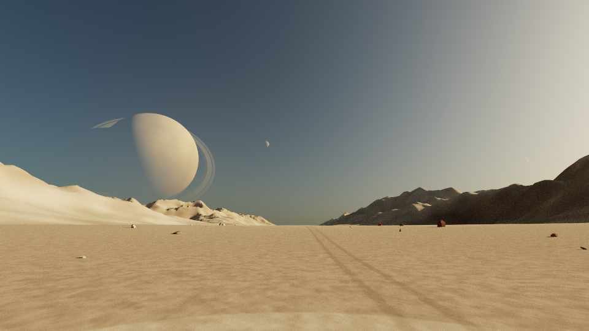

# Seca — the desert road

A fictional observatory on Seca, the middle of three moons orbiting the gas giant
Bruma. The ground takes its visual direction from an Atacama road: an open gravel
basin, warm exposed rock, distant barren ridges, and a tiny unpaved off-road
trail. Two dusty tyre tracks meander through the gravel with an untouched strip
between them, without asphalt or painted lines. Rocks vary in size, proportions,
earthy colours and three-axis orientation; a fixed seed keeps them in place
through animation and reloads. There are no trees, grass, logs or buildings. This is procedural
scenery, not a reconstruction of the supplied Street View location.

Choose **The desert road** in Levels, or **Seca — the desert road** in Explore.
To launch directly:

```sh
cargo run --release -- --config configs/atacama.yaml
```

The camera starts two metres above the ground beside the trail, looking north and 12° above the
horizon. Morning light reveals the ground. Automatic exposure is recommended
(the application's default); previously saved exposure preferences still apply.



## System

| Body | Role | Orbit radius | Period |
|---|---|---:|---:|
| Lumbre | Central star | — | — |
| Cobre | Inner planet | 0.10 AU | 19.524 days |
| Bruma | Ringed gas giant | 0.16 AU | 39.514 days |
| Ascua | Inner moon of Bruma | 110,000 km | 0.893 days |
| Seca | Middle moon; observer's home | 230,000 km | 2.7 days |
| Nacar | Outer moon of Bruma | 360,000 km | 5.287 days |
| Mota | Small submoon of Seca | 10,500 km | 0.40 days |
| Sal | First outer planet | 0.23 AU | 68.101 days |
| Hielo | Second outer planet | 0.33 AU | 117.039 days |

Seca spins freely every 1.35 days: Bruma moves across its sky. Bruma's compact
rings extend from 1.16 to 1.42 planetary radii, well inside Ascua's orbit. Mota
has a radius of 130 km, compared with Seca's 3,200 km. The orbit tracks are
illustrative; the simulator does not integrate tidal evolution or N-body stability.

## Night visibility

See the [low-light sampling study](low-light/README.md) for a benchmark-only
prototype and side-by-side comparisons of ground noise in this scene.

Rewind to day 0, or launch a separate night view:

```sh
STARGAZE_TIME=0 cargo run --release -- --config configs/atacama.yaml
```

Cobre, Sal and Hielo are all above the horizon then. Their radii and reflectances
are tuned to appear modestly brighter than the brightest decorative stars.
They are ordinary reflecting planets, with no emission or artificial dot overlay.
Use the F-key targets in Explore or pan the telescope to find them; they occupy different
parts of the sky. Zoom resolves their discs and phases.

The GPU check measures excess linear luminance above the local sky over a small
image region, against a white catalogue star with brightness 1.62 and angular
radius 0.00136 radians placed along the same sightline. It uses day 0 and the
pixel scale of 720p at 60° vertical FOV, with 1,024 samples per pixel. On the RX 7600 XT, Cobre, Sal and Hielo measured **1.325×, 1.318× and
1.410×** that reference, respectively. This is a rendering calibration,
not astronomical apparent magnitudes. Phase, distance, atmosphere, resolution
and exposure change perceived brightness; daylight can hide both stars and planets.

## Ground preset and checks

`camera.ground: desert` selects the desert heights, materials and rock props.
Omission (or `forest`) preserves the existing forest scenery. Geometry is cached
per preset on the CPU; the GPU reuses its existing buffer and refreshes heights
and curved geometry when the preset changes. No extra persistent GPU buffer is
allocated. The road is a surface material on the continuous terrain, so its
lighting, shadows and perspective follow the same renderer as the rest of the ground.

```sh
cargo run --release -- --check-config configs/atacama.yaml
cargo test --release
cargo test --release gpu_ground_theme_switch -- --ignored --nocapture --test-threads=1
cargo test --release gpu_atacama_planet_brightness -- --ignored --nocapture --test-threads=1
cargo test --release gpu_atacama_preview -- --ignored --nocapture --test-threads=1
```

The preview test writes arrival, night and daylight PNGs under
`target/atacama-preview/`, using the production display pass and automatic exposure.
The switch test verifies that returning from desert to forest at the same host
radius restores the original pixels and resets accumulation. CPU checks cover
the orbital hierarchy, free rotation, morning framing, preset parsing, and terrain bounds.

Validated on the RX 7600 XT: 107 ordinary Rust tests passed, alongside the
GPU theme-switch, brightness and preview checks. The config checker accepts
the nine-body system.
