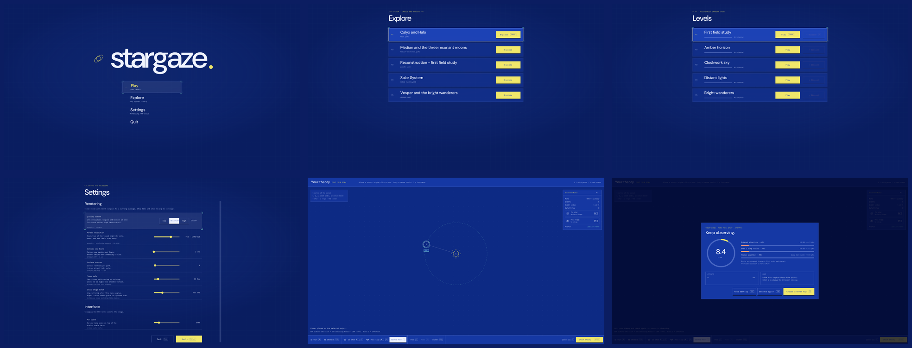
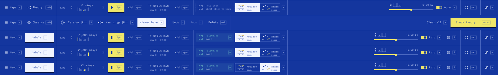
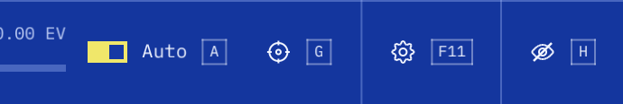

# Celestial Blueprint native menus

The reference is the interactive [Blueprint suite](../prototypes/menu-ui/suite.html),
including its final CSS overrides and keyboard behavior. The native application
opens on Play / Explore / Settings / Quit; explicit system or game options still
open an observatory directly. Per-level theory, observation state, check history,
and best score survive a restart.

## Prototype comparison

| Area | Native implementation |
| --- | --- |
| Main menu | DM Sans wordmark and orbit mark; four entries; Plex Mono descriptions; selected brackets; staggered entrance |
| Explore / Levels | Centered lists, anonymous level names, saved progress and score bars, selected action keycaps, load errors and empty state |
| Settings | Draft presets, resolution, samples, bounces, frame rate, still-image limit, HUD scale; clipped scrolling; Back discards and Apply saves |
| Controls | Three columns, individual keycaps, scrollable reference |
| Theory | Full-page dot canvas, ordered orbits, placement preview, selected inspector, star/ring switches, viewer, undo/redo/delete, clear/check |
| Results | Score dial, weighted breakdown, attempt history, hints, editing/observation/maps actions |
| Dialogs | Clear and discard confirmations, plus keep/discard choices when leaving an active level |
| Time control | Nine signed decade steps, symmetric indicator heights, yellow current step, chevrons, play/pause icons, elapsed clock and day stepping |
| Bottom bar | Shared 84px Maps/Menu and 112px Tab slots, measured labels and keycaps, inline Auto switch, right-edge Hide, identical navigation across views |
| Orientation | Blueprint horizon and constellation vectors, dashed moving elements, gold rotation arrows, white selected option, R shortcut |

The theory bar omits the redundant Selected label; the inspector shows the selected
object. Keycaps share an 8.5px font and centered baseline. The bar uses one
responsive sizing rule in observation and theory, including short and HiDPI windows.

Speed steps are −1,000, −100, −10, −1, 0, +1, +10, +100 and +1,000
simulation minutes per real second. Space pauses and resumes the previous signed
speed. The horizon/stars buttons select a mode; choosing the current mode leaves
the captured orientation intact. R toggles it. Both controls preserve the tracked
body or sky direction and the telescope's zoom.

## Native adaptations

The last traced sky remains behind menu overlays while tracing is paused.
The browser's illustrative sky and prototype navigation rail are not game assets.
Menus and HUD controls shrink to fit small windows; long settings and controls
pages scroll. The elapsed clock uses simulation time; local-day buttons use the
existing orbital solver, including its failure state for synchronous worlds.
The observatory and field-study HUD add a Settings gear with F11, keeping Hide
at the far right. Frame-rate and still-image limits extend the prototype settings
page with the same slider design. They support the requested tradeoff between
smooth motion, paused convergence and maximum detail; existing saved values remain valid.

Colors compose in display space on adapters supporting alternate surface views,
matching CSS translucency. Older GL adapters use the compatible sRGB pipeline.
Fonts rasterize into a cached coverage atlas at their requested physical pixel
size, including fractional DPI and HUD scaling. The GPU samples coverage once;
text no longer stretches a small fixed raster or blurs it with extra filter taps.
Atlas uploads happen only when glyphs change. Fonts and thin strokes use the
same native GPU pipeline in the window and in the screen captures below.

## Validation

The refinement pass passes 98 ordinary tests and Clippy with warnings denied.
The integrated main checkout passes 100 ordinary tests, Clippy on the application,
and the release build. A startup regression checks direct `--game` entry, saved
progress restoration, explicit configurations and preset precedence. The ignored `gpu_blueprint_screens` test checks CSS
alpha composition and captures 19 states at 1280×720, 1920×1080, 1600×900, 1440×900, 1280×480,
800×600 and 640×480 with a 2× requested UI scale: 133 images. Tests cover saved progress,
invalid saves, draft settings, modal input, editor history, lock preservation,
signed playback, orientation transport and repeated selection of the same mode.
Five additional 3840×2160 captures at 2× UI scale bring the total to 138. CPU
layout checks cover UI scales from 1× through 4× at 4K; a GPU pixel comparison
checks native glyph coverage, fractional sizes and atlas reuploads against the
font rasterizer. The new Settings controls cover keyboard and pointer adjustment,
Uncapped/Continuous endpoints, Apply/Cancel and scrolling to the action buttons.

Exact GPU histogram comparisons and the existing Saturn, tiny-viewport,
converged-image and decorative-sky exposure checks validate the smaller meter
dispatch. The level-entry fix adds adaptive sample batching and a single frame
in flight, with nonblocking completion polling. GPU checks cover the reported
35-sample request on Puzzle and Halo, exact sample limits and resetting the
batch on a new view. See [performance measurements](performance.md).

The broader GPU suite previously passed 26 of 27 tests on the Radeon RX 7600 XT.
`gpu_night_ground_has_no_catalogue_fireflies` fails its exact-zero assertion with
8.318893e-14; the untouched baseline commit `aadbb7f` reproduces the same value.
This menu change does not alter that rendering test. Final screen checks also
pass on Mesa's software GL adapter. Native startup was checked on the desktop;
the locked desktop prevented a complete interactive mouse/keyboard walkthrough.

To regenerate the captures:

```sh
STARGAZE_UI_PREVIEWS=/tmp/stargaze-blueprint \
  cargo test --release gpu_blueprint_ -- --ignored --nocapture --test-threads=1
```



The overview shows settled UI rendered offscreen; the traced sky is omitted.

The first two strips compare the shared Maps/Tab section in field study and theory.
The remaining strips show reverse maximum, forward maximum and Stars fixed:



This crop is from the 4K capture at native pixel size, with the direct Settings
button and far-right Hide control:


